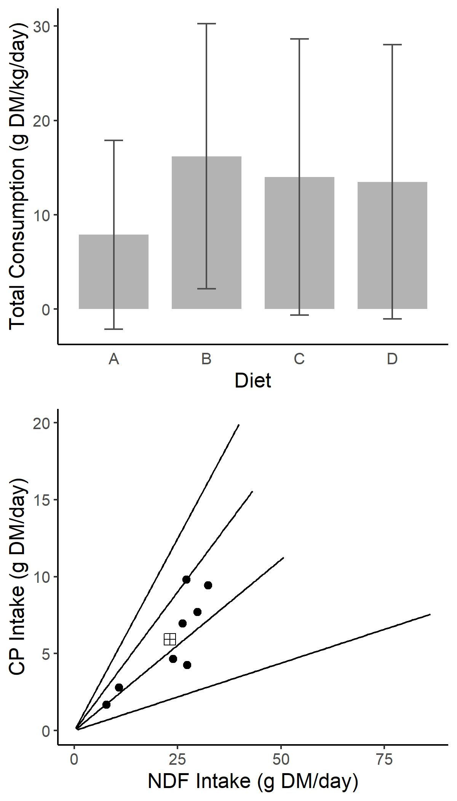
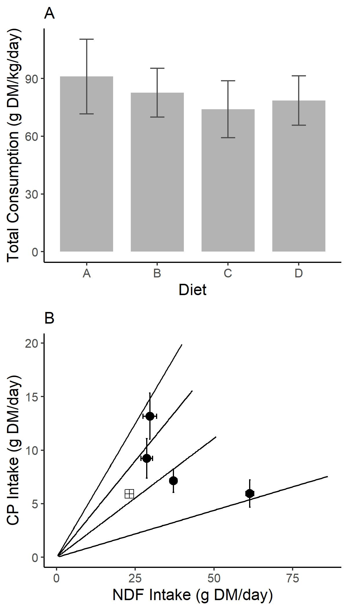
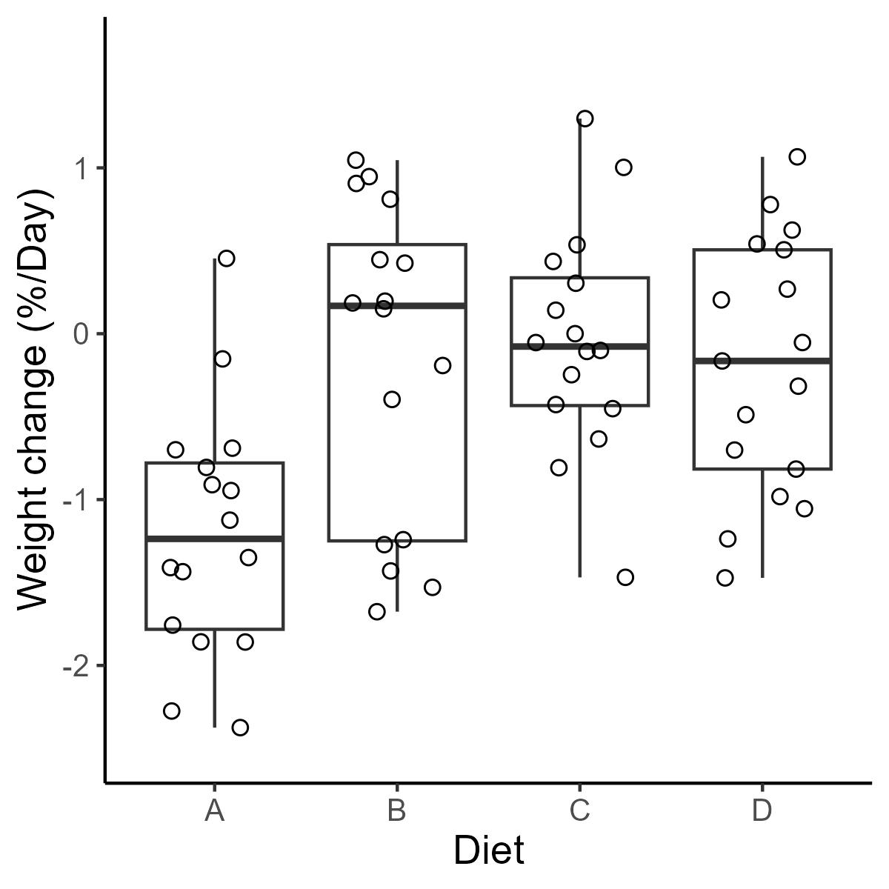
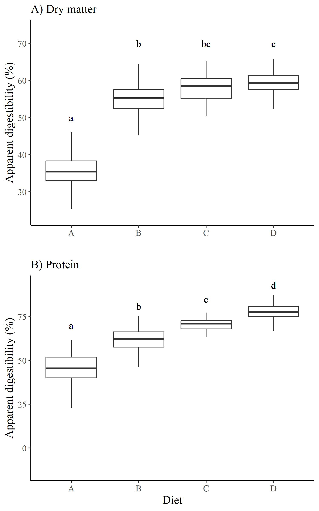

```{r setup, include=FALSE}
knitr::opts_chunk$set(echo = TRUE)
```

```{r naivetrials, include = FALSE}

#source the multichoice script

source("Scripts/05-stats_treatment.R")

```

## Naive multi-choice trials

During the naive multi-choice feeding trial phase of the experiment, snowshoe hares ate an average of `r round(mean(sums$Intake), digits = 2)` ± `r round(sd(sums$Intake), digits = 2)` g DM/day across all diets. There was no significant effect of diet on intake rate during naive multi-choice trials (p = `r MCpval`; Figure 2). Intake rates by diet translated to average intakes of `r round(mean(sums$CP), digits = 2)` ± `r round(sd(sums$CP), digits = 2)` and `r round(mean(sums$NDF), digits = 2)` ± `r round(sd(sums$NDF), digits = 2)` g DM/day of CP and NDF, respectively (Figure 2). The target intake of naive hares fell between the nutritional rails of Diets B and C.



## Single-choice feeding trials: treatment-level analysis

We conducted `r length(trials)` single-choice feeding trials on `r length(unique(trials$ID))` individuals. Hares ate on average `r round(mean(trials$Intake_bw), digits = 2)` g DM/kg/day of food across all diets. There was an overall significant effect of diet on intake rate (p = `r IRpval`; daily measure), but this varied between diets (Figure 3, panel A). The tukey test on this ANOVA shows that intake rates for diets C and D differ significantly from diet A, while all other diets did not differ significantly in intake rate (add stars to Figure 3). This pattern of intake rate resulted in hares on diets B and C to have CP and NDF intake rates closest to the average intake rates of hares offered all diets (Figure 3, panel B).



There was an overall significant effect of diet on weight change during feeding trials (p = `r WCpval`; trial measures). Diet A yielded the highest weight loss over the three-day long trials (`r trials[Diet == "A", round(mean(Weight_change), digits = 2)]` %/day), while diets B and C allowed hares to maintain their original weight over feeding trials (Figure 4). The tukey test showed that weight change differed significantly between diet A and diets B and C (add stars to Figure 4).



Based on fecal composition, diet treatment significantly affected daily CP (p = `r CPdigpval`), NDF (p = `r NDFdigpval`), and ADF (p = `r ADFdigpval`) digestion rates. Across treatments, hares digested more CP as diet CP:NDF increased (from A to D), and CP digestion differed significantly between all combinations of diet except for diets C and B (Figure 5). NDF and ADF digestion rates decreased as CP:NDF increased until diet C, after which NDF and ADF digestion did not change significantly between diet C and D (Figure 5).



## Single-choice feeding trials: geometric analysis

Surface maps visualizing weight change performance (%/day) in relation to CP and NDF intake (g DM/kg/day) show greater performance under more balanced nutrient intakes (central hot spot, see figure below).

```{r}
fitweight <- Tps(trials[, .(NDF_in_bw, CP_in_bw)], trials$Weight_change, scale.type = "range")
surface(fitweight)

```

Surface maps visualizing CP digestion performance (%) in relation to CP and NDF intake (g DM/kg/day) show an strict protein limitation (hot spot at top of plot, see figure below). Greater CP intake led to higher CP digestion rates.

```{r}
fitdigCP <- Tps(day[, .(NDF_in_bw, CP_in_bw)], day$CP_dig, scale.type = "range")
surface(fitdigCP)
```

Surface maps visualizing both NDF and ADF digestion performance (%) in relation to CP and NDF intake (g DM/kg/day) show an NDF limitation. NDF digestion was overall higher (right-hand hot spot; first figure below) than ADF digestion (right-hand hot spot; second figure below). Greater fibre intake led to higher fibre digestion rates.

```{r}
fitdigNDF <- Tps(day[, .(NDF_in_bw, CP_in_bw)], day$NDF_dig, scale.type = "range")
surface(fitdigNDF)

```

```{r}
fitdigADF <- Tps(day[, .(NDF_in_bw, CP_in_bw)], day$ADF_dig, scale.type = "range")
surface(fitdigADF)
```
