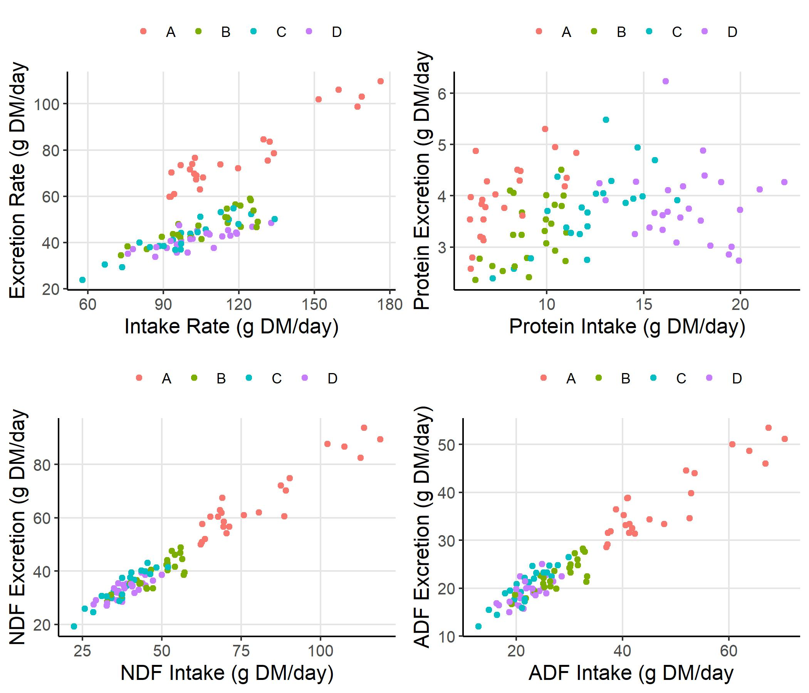

```{r setup, include=FALSE}
knitr::opts_chunk$set(echo = TRUE)
```

```{r naivetrials, include = FALSE}

#source the multichoice script

source("Scripts/05-stats_treatment.R")

```

## Multi-choice feeding trials

During the naive multi-choice feeding trial phase of the experiment, snowshoe hares ate an average of `r round(mean(sums$DMI_bw), digits = 2)` ± `r round(sd(sums$DMI_bw), digits = 2)` g DM/day across all diets. There was a significant effect of diet on intake rate during naive multi-choice trials (p = `r MCpval`). Out of all diets, hares ate the most from diet B. Intake rates by diet translated to average intakes of `r round(mean(sums$DMI_CP_bw), digits = 2)` ± `r round(sd(sums$DMI_CP_bw), digits = 2)` and `r round(mean(sums$DMI_NDF_bw), digits = 2)` ± `r round(sd(sums$DMI_NDF_bw), digits = 2)` g DM/day of CP and NDF, respectively (Figure 2). The target intake of naive hares fell between the nutritional rails of Diets B and C.

## Single-choice feeding trials: results by treatment

We conducted `r length(trials)` single-choice feeding trials on `r length(unique(trials$ID))` individuals. Hares ate on average `r round(mean(trials$DMI_bw), digits = 2)` g DM/kg/day of food across all diets. There was an overall significant effect of diet on intake rate (p = `r IRpval`; daily measure). According to the Tukey test, the intake rate for diet A differed significantly from all other diets while differences between diets B, C, and D were not significant (Figure 3, panel A). This pattern of intake rate resulted in hares on diets B and C to have CP and NDF intake rates closest to the target intake found in the multi-choice trials (Figure 3, panel B).

There was an overall significant effect of diet on weight change during feeding trials (p = `r WCpval`; trial measures). Diet A yielded the greatest weight loss over the three-day long trials (`r trials[Diet == "A", round(median(Weight_change)*100, digits = 2)]` %/day). Diets C and D caused slight weightloss; hares could only maintain their weight on diet B (`r trials[Diet == "B", round(median(Weight_change)*100, digits = 2)]` %/day; Figure 4). The Tukey test showed that weight change differed significantly between diet A and all other diets (Figure 4).

Based on fecal composition and quantity, diet DMD followed a similar trend to weight change: diet A was significantly less digestible than all other diets. Diet B was also significantly less digestible than diet D. All other diet comparisons were not significant. Daily CP (p = `r CPdigpval`) and NDF (p = `r NDFdigpval`) digestion rates also difference between diets. CP digestibility increased significantly as diet CP increased from A to B (Figure 5). Diet A and B produced similar NDF digestive rates, which were significantly higher than that of diet C. There was no significant difference in NDF digestibility of diet D and the other three diets (Figure 5).

## Single-choice feeding trials: results by nutrient intake


![Figure 2. Feeding responses (g dry matter/kg/day) by snowshoe hares during the naiive, multi-choice phase of the feeding trial experiment (n = 32) in which we offered individual hares four experimental diets simulatenously for one day. Diets A, B, C, and D had crude protein (CP) to neutral detergent fibre (NDF) ratios of 0.083, 0.22, 0.36, and 0.5 respectively. Panel A shows dry matter (DM) intake rate per kg body weight by diet treatment, with bars representing means and error bars representing standard deviations. Panel B places intake rates in Panel A in nutrient space. In Panel B, each black point represents the total CP intake plotted against total NDF intake by individual hares, summing their intake of all diets in the multi-choice feeding trial. The cross point represents the mean CP and NDF intake across all hares. Diet rails (CP:NDF) are represented by black lines.](Output/figures/targetintake.jpeg)

![Figure 3. Feeding responses (g dry matter/kg/day) by snowshoe hares during the single-choice phase of the feeding trial experiment (n = 99) in which we offered individual hares one of four experimental diets for three days. Diets A, B, C, and D had crude protein (CP) to neutral detergent fibre (NDF) ratios of 0.083, 0.22, 0.36, and 0.5 respectively. Panel A shows dry matter (DM) intake rate per kg body weight by diet treatment, with bars representing means and error bars representing standard deviations. Panel B places intake rates in Panel A in nutrient space. Panel B shows mean intake rates (black points; error bars = standard deviation) of each diet along diet rails (CP:NDF) that are represented with black lines. Mean intake rates of diets are represented along the axes as CP intake against NDF intake in terms of dry matter.](Output/figures/intakebarandrail.jpeg)


![Figure 5. From left panel to right panel: crude protein (CP), neutral detergent fibre (NDF), and acid detergent fibre (ADF), digestability (proportion digested) in response to feeding on one of four experimental diets fo three days during the single-choice phase of the feeding trial experiment (n = 33). Diets A, B, C, and D had crude protein (CP) to neutral detergent fibre (NDF) ratios of 0.083, 0.22, 0.36, and 0.5 respectively. Boxes represent median digestability bounded by lower 25th and 75th percentiles.](Output/figures/dietdigestion.jpeg)

## Single-choice feeding trials: preliminary geometric analysis


```{r}
#surface map to show weight change in response to NDF and CP
fitCP <- Tps(trials[, .(DMI_NDF_bw, DMI_CP_bw)], trials$Weight_change, scale.type = "range")
surface(fitCP, x = "NDF intake (g DM/kg^0.75/day)", 
        y = "CP intake (g DM/kg^0.75/day)")

```
Above: Surface maps visualizing weight change performance (%/day) in relation to CP and NDF intake (g DM/kg/day).


```{r}
#surface map showing weight change in response to intake of digestable protein and NDF
fitDP <- Tps(trials[, .(DNDFI, DPI)], trials$Weight_change, scale.type = "range")
surface(fitDP, x = "Digestible NDF intake (g DM/kg^0.75/day)", 
        y = "Digestible CP intake (g DM/kg^0.75/day)")

```
Above: Surface map visualizing weight change performance (%/day) in relation to digestible protein and digestible NDF intake (g DM/kg/day).


```{r}
#surface map showing DMD in response to protein-fibre balance

dmd <- Tps(trials[, .(DMI_NDF_bw, DMI_CP_bw)], trials$DMD, scale.type = "range")
surface(dmd, x = "NDF intake (g DM/kg^0.75/day)", 
        y = "CP intake (g DM/kg^0.75/day)")
```


## Additional figures


