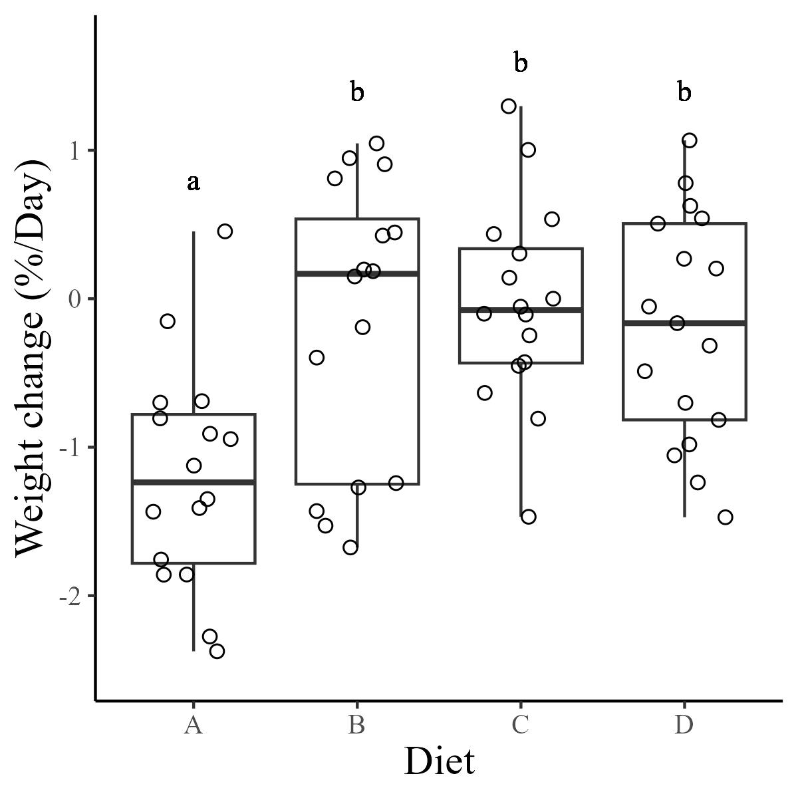

```{r setup, include=FALSE}
knitr::opts_chunk$set(echo = TRUE)
```

```{r naivetrials, include = FALSE}

#source the multichoice script

source("Scripts/05-stats_treatment.R")
```

## Naive trials

During the naive multi-choice feeding trial phase of the experiment, snowshoe hares ate an average of `r round(mean(sums$Intake), digits = 2)` ± `r round(sd(sums$Intake), digits = 2)` g DM/day across all diets. There was no significant effect of diet on intake rate during naive multi-choice trials (p = `r MCpval`; Figure 2). Intake rates by diet translated to average intakes of `r round(mean(sums$CP), digits = 2)` ± `r round(sd(sums$CP), digits = 2)` and `r round(mean(sums$NDF), digits = 2)` ± `r round(sd(sums$NDF), digits = 2)` g DM/day of CP and NDF, respectively (Figure 2). The target intake of naive hares fell between the nutritional rails of Diets B and C.


## Feeding trials

We conducted `r length(trials)` single-choice feeding trials on `r length(unique(trials$ID))` individuals. Hares ate on average `r round(mean(trials$Intake_bw), digits = 2)` g DM/kg/day of food across all diets. There was an overall significant effect of diet on intake rate (p = `r IRpval`; daily measure), but this varied between diets (Figure 3, panel A). The tukey test on this ANOVA shows that intake rates for diets C and D differ significantly from diet A, while all other diets did not differ significantly in intake rate (add stars to Figure 3). This pattern of intake rate resulted in hares on diets B and C to have CP and NDF intake rates closest to the average intake rates of hares offered all diets (Figure 3, panel B). 


There was an overall significant effect of diet on weight change during feeding trials (p = `r WCpval`; trial measures). Diet A yielded the highest weight loss over the three-day long trials (`r trials[Diet == "A", round(mean(Weight_change), digits = 2)]` %/day), while diets B and C allowed hares to maintain their original weight over feeding trials (Figure 4). The tukey test showed that weight change differed significantely between diet A and diets B and C (Figure 4).




digestion